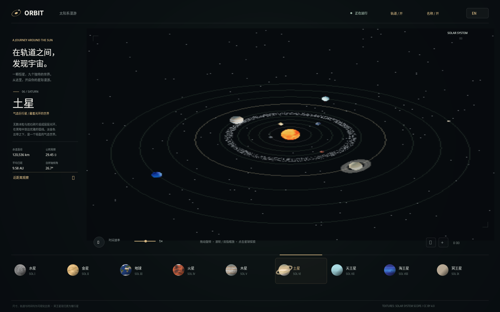
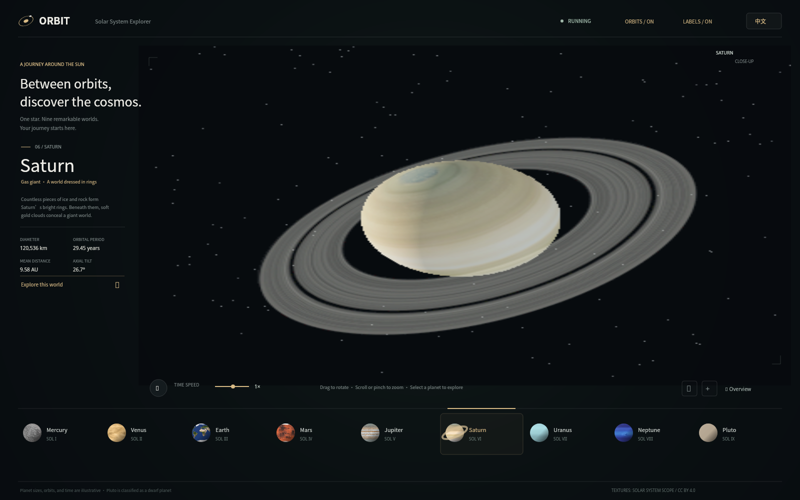

# ORBIT — Solar System Explorer

## 🧪 智能体能力测试 | Agent Capability Test

> **中文** 
> 这是一个智能体能力测试的题目，可以简单测试模型能力。使用一段提示词： 
> **“给我绘制一个九大行星绕着太阳运行的 HTML 动画，需要可以旋转视角、可以缩放，而且每个星球都有自己的特征。”**
>
> **English** 
> This is an agent capability test that offers a simple way to assess a model’s capabilities. Use this prompt: 
> **“Create an HTML animation of the nine planets orbiting the Sun. It should let me rotate the view and zoom in or out, and each planet should have its own distinctive features.”**

---

ORBIT is a self-contained, interactive 3D tour of the Sun, the eight planets, and Pluto. It pairs an orbiting WebGL solar system with a calm, editorial-style explorer interface. Select a world to open its profile, then zoom in to study its surface, atmosphere, or rings.

The page supports **English and Chinese**. Use the language button in the upper-right corner to switch the entire interface and planet information instantly.

## Screenshots

### Solar system overview

### Saturn close-up

## A simple test of an AI model’s intelligence level

This project can serve as a small, informal test of an AI model’s ability to understand and complete a multi-part creative coding task. The task is approachable, but it asks the model to connect several kinds of work: building a 3D scene, making the scene usable, presenting meaningful information, and delivering a finished project.

It is **not** a standardized intelligence test, a scientific benchmark, or a measure of general IQ. Results depend on the prompt, the model’s tools, and the evaluator. Use it as a quick, qualitative way to compare how well models turn a short brief into a coherent working experience.

### Suggested test prompt

> Create an HTML animation of the nine planets orbiting the Sun. It should let me rotate the view and zoom in or out, and each planet should have its own distinctive features.

Give each model the same starting files and prompt. Score the result by inspecting the page and trying its controls; do not score prose claims alone.

| Area | 0 points | 1 point | 2 points |
| --- | --- | --- | --- |
| Instruction following | Misses several requested parts | Delivers the main scene, with notable omissions | Delivers the scene, controls, bilingual content, documentation, and screenshots |
| 3D scene | Scene is missing or broken | Scene renders, but planets or orbits are hard to distinguish | Solar system renders clearly, with distinct worlds and visible orbits |
| Interaction | Rotation, zoom, or selection does not work | Some controls work, with rough or inconsistent behavior | Rotation, zoom, selection, and return-to-overview work reliably |
| Planet details | Worlds look alike and have no useful information | Some worlds have distinct styling or basic facts | Worlds have recognizable visual traits and useful individual profiles |
| Finish and delivery | Hard to run or understand | Runs with limited instructions | Polished layout, clear README, working language switch, and usable screenshots |

**Maximum: 10 points.** This is a practical project checklist, not a universal model ranking. Keep the model, prompt, starting state, and scoring conditions the same when comparing results.

## Features

- **Three-dimensional WebGL scene** with a textured Sun, nine orbiting worlds, starfield, asteroid belt, and adjustable orbit and name overlays.
- **Distinct planetary details:** cloud-shrouded Venus, Earth's oceans and clouds, Jupiter’s banded atmosphere, Saturn’s rings, tilted Uranus, and an illustrated Pluto surface.
- **Planet profiles** with a short description, diameter, orbital period, average distance from the Sun, and axial tilt.
- **Close-up exploration** for each planet, with a quick return to the full solar-system view.
- **Camera controls:** drag to rotate, mouse wheel to zoom, pinch on touchscreens, and on-screen zoom and reset controls.
- **Animation controls:** pause or resume the motion and adjust the simulation speed.
- **One-click English/Chinese switch** for the interface, controls, labels, and planet profiles.
- **Single-file delivery:** Three.js and the planet maps are embedded in `index.html`; the page makes no external requests when opened.
- Responsive layout for desktop and mobile screens.

> Planet sizes, distances, orbital spacing, and simulation speed are visualized for clarity; they are not presented to scale. Pluto is included as a dwarf planet.

## Run it

Open [`index.html`](index.html) in a current browser with WebGL enabled. No package installation, build step, or network connection is required. Hardware acceleration is recommended for smooth rendering.

## Controls

| Action | Control |
| --- | --- |
| Rotate the view | Drag on the solar-system canvas |
| Zoom | Scroll, pinch, or use the `+` and `−` buttons |
| Explore a planet | Select a planet in the bottom navigation or click its sphere |
| Return to the overview | Use **Overview** / **全景** |
| Pause or resume | Use the `Ⅱ` / `▶` button, or press Space while the canvas is focused |
| Rotate with a keyboard | Focus the canvas and use the arrow keys |
| Show or hide orbit lines and labels | Use the controls in the top-right corner |
| Change language | Use **EN** / **中文** in the top-right corner |

## Implementation

- HTML, CSS, and JavaScript in one page
- [Three.js](https://threejs.org/), bundled in `index.html` (MIT License)
- Planet texture maps from [Solar System Scope](https://www.solarsystemscope.com/textures/) (CC BY 4.0)

The interface and simulation run locally. The source texture maps remain subject to their original attribution and license.
